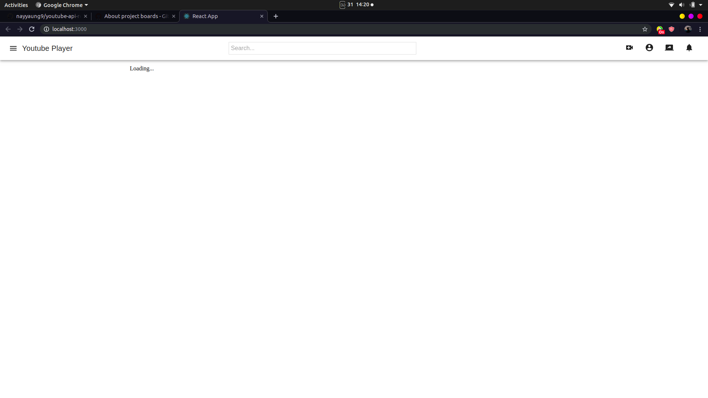
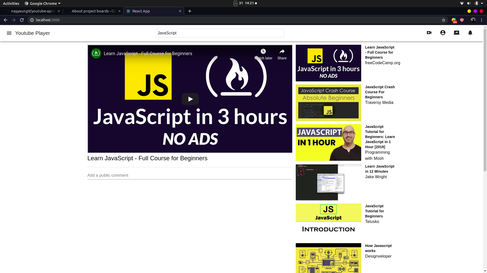

# React Youtube Player App
This App is used youtube v3 api to get access data on localhost

## Installation

> git clone https://github.com/nayyaung9/youtube-api-react.git
> npm install
> npm start 

## Initial App look like this

## The Whole App look like this